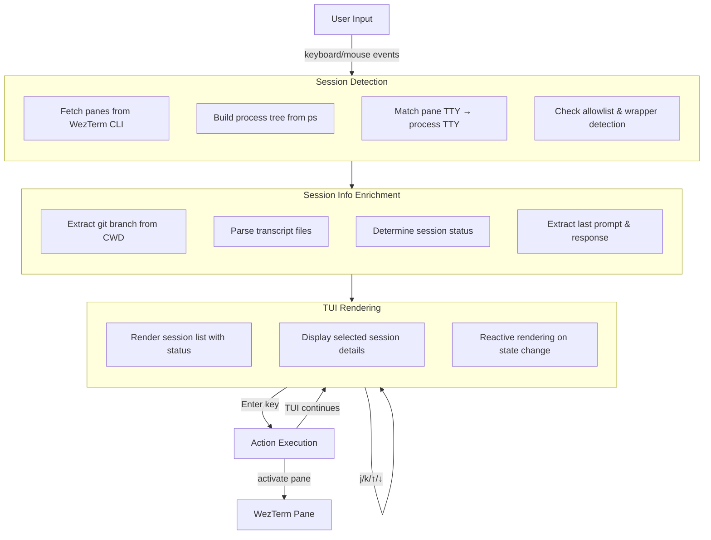

<div align="center">

# wzcc

## WezTerm Claude Code Session Manager

A TUI tool to list and navigate Claude Code sessions running in WezTerm tabs/panes. Quickly jump between multiple Claude Code instances with intelligent session detection.

<div align="center">
  <a href="https://github.com/K-dash/wzcc/graphs/commit-activity"></a>
  <a href="https://github.com/K-dash/wzcc/blob/main/LICENSE"></a>
  <a href="https://www.rust-lang.org/"></a>
</div>

<p>
  <a href="#quick-start">Quick Start</a>
  ◆ <a href="#features">Features</a>
  ◆ <a href="#installation">Installation</a>
  ◆ <a href="#architecture">Architecture</a>
  ◆ <a href="docs/wezterm-tips.md">WezTerm Tips</a>
</p>


</div>

## What is wzcc?

wzcc simplifies management of multiple Claude Code sessions in WezTerm. Instead of manually navigating between tabs and panes, wzcc provides an interactive TUI that displays all active Claude Code sessions with their status and context.

**Key capabilities:**
- Auto-detects Claude Code sessions using TTY matching + process tree analysis
- Shows session status: Processing, Idle, Ready, or Waiting for user approval
- Displays last user prompt and assistant response for quick context
- Extracts and displays git branch from each session's working directory
- One-keystroke navigation between sessions

## Features

### Session Detection
- **TTY Matching**: Matches WezTerm pane TTY with running process TTY
- **Wrapper Support**: Detects Claude Code even when launched through wrapper scripts
- **Process Tree Analysis**: Uses ancestor process checking to identify wrapped sessions
- **Default Allowlist**: Detects processes named `claude` or `anthropic` (customization requires code modification)

### Session Information
- **Status Detection**: Reads Claude Code transcript files to determine session status
  - `Ready`: Fresh session, no transcript entries yet or only internal entries
  - `Processing`: Last entry is progress, tool_result, user input, or recent tool_use (<10s)
  - `Idle`: Last entry is assistant response, end_turn, turn_duration, or stop_hook_summary
  - `Waiting`: Tool invocation pending user approval (>10s timeout by default)
  - `Unknown`: Status cannot be determined
- **Context Display**: Shows last user prompt and assistant response
- **Git Integration**: Extracts git branch name from session working directory
- **Pane Details**: Displays pane ID, working directory, TTY, status, and git branch

### User Interface
- **Multi-Workspace Support**: Shows sessions from all workspaces, grouped with visual hierarchy (🏠 current, 📍 others)
- **Cross-Workspace Navigation**: Jump to sessions in different workspaces with automatic workspace switching
- **Real-time Updates**: Uses `notify` crate to watch transcript files for changes - status updates instantly without polling
- **Efficient Rendering**: Event-driven, only redraws when state changes
- **Quick Select**: Press `1-9` to instantly jump to a session (numbers shown in list)
- **Relative Time Display**: Shows elapsed time since last activity (e.g., `5s`, `2m`, `1h`)
- **Keybindings Help**: Footer shows available keybindings at a glance
- **Keybindings**: vim-style (`j`/`k`) and arrow keys for navigation
- **Prompt Input**: Send prompts directly to Claude Code sessions from the details panel (`i` key, supports multi-line via `Ctrl+O`)
- **Double-click Support**: Click list items to jump
- **Live Refresh**: `r` key refreshes session list

## Quick Start

### Prerequisites

- **WezTerm v20240203-110809 or later**
  - Must be run **inside WezTerm** (relies on `WEZTERM_PANE` environment variable)
  - Does not work in external terminals or SSH sessions
- **macOS 14+** (Linux support in progress)
- **Rust 1.70+** (to build from source)

### Installation

```bash
# Clone the repository
git clone https://github.com/K-dash/wzcc.git
cd wzcc

# Build and install to ~/.cargo/bin
cargo install --path .

# (Recommended) Install optional components for full functionality
wzcc install
```

> **Note**: `wzcc install` sets up workspace switching and statusLine bridge for accurate session detection. See [Limitations](#limitations) for details on what each component does.

### Running

```bash
# Start the TUI (lists all Claude Code sessions in current workspace)
wzcc

# Or explicitly specify TUI mode
wzcc tui
```

### Using wzcc

**Keybindings:**

| Key | Action |
|-----|--------|
| `j` / `↓` | Move to next session |
| `k` / `↑` | Move to previous session |
| `1-9` | Quick select & focus session by number |
| `g` + `g` | Jump to first session |
| `G` | Jump to last session |
| `h` / `l` | Resize details panel (h: shrink, l: expand) |
| `i` | Open prompt input (send text to selected session) |
| `x` | Kill (close) selected session's pane (with confirmation) |
| `a` | Add new Claude Code session (split selected pane, then choose `r`ight/`d`own) |
| `Enter` / Double-click | Switch to selected session (TUI continues) |
| `c` | Quit TUI |
| `q` / `Esc` | Quit TUI |
| `r` | Refresh session list |

**Prompt Input Mode** (press `i` to enter):

| Key | Action |
|-----|--------|
| `Enter` | Send prompt to session and focus the pane |
| `Ctrl+O` | Insert newline (multi-line input) |
| `Esc` | Cancel and exit input mode |
| `Ctrl+U` | Clear input buffer |

## Configuration

wzcc can be configured via `~/.config/wzcc/config.toml`. All settings are optional and have sensible defaults.

```toml
# Command to launch when adding a new session (press 'a')
# Default: ["claude"]
spawn_command = ["claude"]

# With arguments
# spawn_command = ["claude", "--dangerously-skip-permissions"]

# Custom wrapper script
# spawn_command = ["my-claude-wrapper", "--profile", "dev"]
```

| Setting | Type | Default | Description |
|---------|------|---------|-------------|
| `spawn_command` | Array of strings | `["claude"]` | Command and arguments to run when spawning a new session |

## Architecture

### Data Flow



### Session Status Detection

wzcc reads Claude Code transcript files located in `~/.claude/projects/{encoded-cwd}/{session_id}.jsonl` (where `encoded-cwd` replaces `/`, `.`, and `_` with `-`) and examines the transcript structure to determine session status:

| Status | Condition |
|--------|-----------|
| `Processing` | Last entry is progress event, tool_result from user, user input (Claude responding), or recent tool_use invocation (<10 seconds) |
| `Idle` | Last entry is assistant response, end_turn marker, turn_duration, or stop_hook_summary |
| `Waiting` | Tool use pending user approval (>10 seconds elapsed) |
| `Ready` | Fresh session with no meaningful entries yet |
| `Unknown` | Transcript parsing failed, status cannot be determined, or statusLine bridge is stale |

### When Status Becomes Unknown (Stale Sessions)

When using the statusLine bridge, wzcc tracks session information via TTY-keyed mapping files that are updated every 300ms. If a mapping file hasn't been updated for more than **5 minutes**, the session is considered "stale" and its status will show as `Unknown` with a warning message.

**Common causes of stale sessions:**

| Cause | Solution |
|-------|----------|
| Claude Code session was closed | Normal behavior - mapping will be cleaned up |
| `settings.json` was modified after session started | Restart the Claude Code session to pick up new settings |
| statusLine command is failing | Check `~/.claude/wzcc_statusline_bridge.sh` for errors |

**Why this matters:** Without stale detection, sessions sharing the same working directory could display incorrect status from another session's transcript. The stale check prevents this by showing `Unknown` instead of potentially wrong information.

## Limitations

### Cross-Workspace Navigation

wzcc displays sessions from **all workspaces** and can switch between them. However, this requires a one-time setup since WezTerm CLI doesn't provide a native workspace switch command.

**Solution: Install the workspace switcher**

```bash
wzcc install-workspace-switcher
# Or use: wzcc install (installs all components)
```

This command injects a Lua snippet into your `wezterm.lua` that listens for OSC 1337 escape sequences and performs workspace switches.

**After installation**, restart WezTerm or reload config (`Ctrl+Shift+R`) for changes to take effect.

**To uninstall:**

```bash
wzcc uninstall-workspace-switcher
```

**Without the switcher:**
- Sessions from all workspaces are still displayed
- Jumping to a session in a different workspace will activate the pane but not switch the workspace view

### Multiple Sessions with Same Working Directory

When multiple Claude Code sessions share the same working directory, wzcc needs additional setup to accurately display each session's status and output. Without the statusLine bridge, session identification relies on transcript paths using encoded working directory names, which cannot distinguish between multiple sessions in the same directory.

**Solution: Install the statusLine bridge**

```bash
wzcc install-bridge
# Or use: wzcc install (installs all components)
```

This command:
1. Creates a bridge script at `~/.claude/wzcc_statusline_bridge.sh`
2. Configures Claude Code's `statusLine.command` to use the bridge
3. Preserves any existing statusLine configuration by chaining calls

The bridge leverages Claude Code's statusLine feature (which updates every 300ms) to write session information keyed by TTY. This allows wzcc to accurately identify and display each session even when multiple sessions share the same CWD.

**After installation**, restart your Claude Code sessions for the changes to take effect.

**To uninstall:**

```bash
wzcc uninstall-bridge
```

**Without the bridge:**
- Session status detection still works but may show wrong data for multi-CWD sessions
- A message prompts you to run `wzcc install-bridge`
- Individual pane IDs remain accurate

### Platform Support

| Platform | Status |
|----------|--------|
| macOS 14+ | ✅ Full support |
| Linux | 🚧 Experimental |
| Windows | ❌ Not supported |
| Remote Mux | ❌ Not supported |

## License

This project is licensed under the **MIT License** - see the [LICENSE](LICENSE) file for details.
