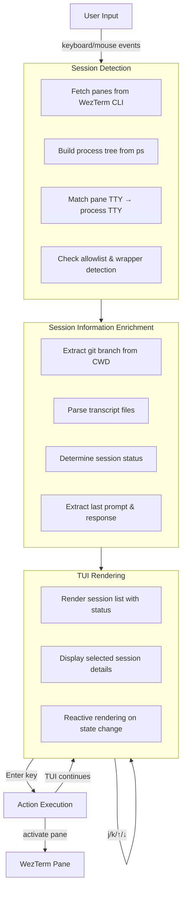

<div align="center">

# wzcc

## WezTerm Claude Code Session Manager

A TUI tool to list and navigate Claude Code sessions running in WezTerm tabs/panes. Quickly jump between multiple Claude Code instances with intelligent session detection.

<div align="center">
  <a href="https://github.com/furukawa/wzcc/graphs/commit-activity"></a>
  <a href="https://github.com/furukawa/wzcc/blob/main/LICENSE"></a>
  <a href="https://www.rust-lang.org/"></a>
</div>

<p>
  <a href="#quick-start">Quick Start</a>
  ◆ <a href="#features">Features</a>
  ◆ <a href="#installation">Installation</a>
  ◆ <a href="#architecture">Architecture</a>
</p>

</div>

## What is wzcc?

wzcc simplifies management of multiple Claude Code sessions in WezTerm. Instead of manually navigating between tabs and panes, wzcc provides an interactive TUI that displays all active Claude Code sessions with their status and context.

**Key capabilities:**
- Auto-detects Claude Code sessions using TTY matching + process tree analysis
- Shows session status: Processing, Idle, Ready, or Waiting for user approval
- Displays last user prompt and assistant response for quick context
- Extracts and displays git branch from each session's working directory
- One-keystroke navigation between sessions

## Features

### Session Detection
- **TTY Matching**: Matches WezTerm pane TTY with running process TTY
- **Wrapper Support**: Detects Claude Code even when launched through wrapper scripts
- **Process Tree Analysis**: Uses ancestor process checking to identify wrapped sessions
- **Default Allowlist**: Detects processes named `claude` or `anthropic` (customization requires code modification)

### Session Information
- **Status Detection**: Reads Claude Code transcript files to determine session status
  - `Ready`: Fresh session, no transcript entries yet or only internal entries
  - `Processing`: Last entry is progress, tool_result, user input, or recent tool_use (<10s)
  - `Idle`: Last entry is assistant response, end_turn, turn_duration, or stop_hook_summary
  - `Waiting`: Tool invocation pending user approval (>10s timeout by default)
  - `Unknown`: Status cannot be determined
- **Context Display**: Shows last user prompt and assistant response
- **Git Integration**: Extracts git branch name from session working directory
- **Pane Details**: Displays pane ID, working directory, TTY, status, and git branch

### User Interface
- **Efficient Rendering**: Event-driven, only redraws when state changes
- **Keybindings**: vim-style (`j`/`k`) and arrow keys for navigation
- **Double-click Support**: Click list items to jump
- **Live Refresh**: `r` key refreshes session list

## Quick Start

### Prerequisites

- **WezTerm v20240203-110809 or later**
  - Must be run **inside WezTerm** (relies on `WEZTERM_PANE` environment variable)
  - Does not work in external terminals or SSH sessions
- **macOS 14+** (Linux support in progress)
- **Rust 1.70+** (to build from source)

### Installation

```bash
# Clone the repository
git clone https://github.com/furukawa/wzcc.git
cd wzcc

# Build release binary
cargo build --release

# Install to ~/.cargo/bin
cargo install --path .
```

### Running

```bash
# Start the TUI (lists all Claude Code sessions in current workspace)
wzcc

# Or explicitly specify TUI mode
wzcc tui

# Start background daemon (experimental - updates tab titles with session status)
wzcc daemon
```

**Note**: Daemon mode is experimental. It monitors sessions in the current workspace and updates WezTerm tab titles with status. Polling interval is 3 seconds. Currently only works in the current workspace.

### Using wzcc

Once the TUI launches:

```
┌─ Claude Code Sessions (2) ────────────┬─ Details ────────────────┐
│ 📂 projects/app (2 sessions)          │ Pane: 92                 │
│   >> ◐ Pane 92: Docs [Waiting]        │                          │
│      ● Pane 228: Coding [Idle]        │ CWD:                     │
│ 📂 develop/feature                    │ ~/hobby/wzcc             │
│      ○ Pane 235: Setup [Ready]        │                          │
│                                       │ TTY: /dev/ttys042        │
│                                       │                          │
│                                       │ Status: Waiting          │
│                                       │                          │
│                                       │ Branch: feature/docs     │
│                                       │                          │
│                                       │ Last prompt:             │
│                                       │ > Generate README file   │
│                                       │                          │
│                                       │ Last output (preview):   │
│                                       │ # Project README         │
└───────────────────────────────────────┴──────────────────────────┘
[↑/↓] Select  [Enter] Switch  [c/q] Quit  [r] Refresh  [g+g] Top
```

**Keybindings:**

| Key | Action |
|-----|--------|
| `j` / `↓` | Move to next session |
| `k` / `↑` | Move to previous session |
| `g` + `g` | Jump to first session |
| `G` | Jump to last session |
| `Enter` / Double-click | Switch to selected session (TUI continues) |
| `c` | Quit TUI |
| `q` / `Esc` | Quit TUI |
| `r` | Refresh session list |

## Installation

### From Source

```bash
# Clone repository
git clone https://github.com/furukawa/wzcc.git
cd wzcc

# Build and install
cargo install --path .
```

### Verify Installation

```bash
wzcc --version
```

## Architecture

### Data Flow



### Component Breakdown

| Component | Responsibility |
|-----------|-----------------|
| **UI Layer** (`src/ui/`) | Event handling, rendering, state management |
| **Session** (`src/ui/session.rs`) | Session data structure, status detection, transcript parsing |
| **Detector** (`src/detector/`) | Claude Code identification via TTY matching & process trees |
| **DataSource** (`src/datasource/`) | WezTerm pane & system process data retrieval |
| **CLI** (`src/cli/`) | WezTerm command execution wrappers |
| **Models** (`src/models/`) | Data structures (Pane, etc.) |
| **Transcript** (`src/transcript/`) | Claude Code transcript parsing and analysis |
| **Daemon** (`src/daemon/`) | Background monitoring (experimental) |

### Detection Strategy: TTY Matching with Wrapper Support

1. **Fetch Panes**: Get list of all WezTerm panes and their TTY assignments
2. **Extract TTY**: For each pane, extract short TTY name (e.g., `ttys001` from `/dev/ttys001`)
3. **Build Process Tree**: Run `ps` to collect all processes with PID, PPID, TTY, command, and args
4. **Match Process**: For each pane, find processes with matching TTY
5. **Check Allowlist**: Verify process command/args matches `["claude", "anthropic"]`
6. **Wrapper Support**: If direct match fails, check if any ancestor process matches allowlist
7. **Exclusion**: Exclude the pane running wzcc itself (via `WEZTERM_PANE` env var)

**Accuracy**: ~90% detection rate without relying on unstable WezTerm fields.

### Session Status Detection

wzcc reads Claude Code transcript files located in `~/.claude/projects/{encoded-cwd}/{session_id}.jsonl` (where `encoded-cwd` replaces `/`, `.`, and `_` with `-`) and examines the transcript structure to determine session status:

| Status | Condition |
|--------|-----------|
| `Processing` | Last entry is progress event, tool_result from user, user input (Claude responding), or recent tool_use invocation (<10 seconds) |
| `Idle` | Last entry is assistant response, end_turn marker, turn_duration, or stop_hook_summary |
| `Waiting` | Tool use pending user approval (>10 seconds elapsed) |
| `Ready` | Fresh session with no meaningful entries yet |
| `Unknown` | Transcript parsing failed or status cannot be determined |

## Limitations

### Workspace Scope

wzcc only displays and manages sessions in your **current WezTerm workspace**. WezTerm CLI doesn't provide workspace switching commands, so:

1. Switch workspace manually in WezTerm UI
2. Run `wzcc` again to show sessions in that workspace

This is a WezTerm CLI limitation, not a wzcc limitation.

### Multiple Sessions with Same Working Directory

When multiple Claude Code sessions share the same working directory, wzcc cannot reliably display the last prompt and assistant response for those sessions. This is because session identification is based on transcript paths, which use encoded working directory names. In this case:
- Session status detection still works correctly
- Last prompt/output display is disabled to prevent confusion
- Individual pane IDs remain accurate

This is a known limitation when using multiple Claude Code instances in the same project directory.

### Platform Support

| Platform | Status |
|----------|--------|
| macOS 14+ | ✅ Full support |
| Linux | 🚧 Experimental |
| Windows | ❌ Not supported |
| Remote Mux | ❌ Not supported |

## Development

### Build

```bash
# Debug build
cargo build

# Release build (recommended)
cargo build --release
make release
```

### Run

```bash
# Run TUI
cargo run

# Run with debug output
RUST_LOG=debug cargo run
```

### Testing & Code Quality

```bash
# Run all tests
cargo test
make test

# Run specific test
cargo test test_detect_wrapper_detected

# Format code
cargo fmt
make fmt

# Lint with clippy
cargo clippy -- -D warnings
make lint

# Run full CI checks (format check, lint, test)
make ci
```

### Project Structure

```
wzcc/
├── src/
│   ├── main.rs                 # Entry point, CLI handling
│   ├── lib.rs                  # Library exports
│   ├── ui/
│   │   ├── mod.rs              # UI module exports
│   │   ├── app.rs              # Main app loop, event handling
│   │   ├── session.rs          # ClaudeSession struct, status/output detection
│   │   ├── render.rs           # Rendering functions (list, details)
│   │   ├── event.rs            # Event definitions and key bindings
│   │   └── toast.rs            # Toast notification support
│   ├── detector/
│   │   ├── mod.rs              # Detector exports
│   │   └── identify.rs         # ClaudeCodeDetector, TTY matching logic
│   ├── datasource/
│   │   ├── mod.rs              # DataSource trait definitions
│   │   ├── wezterm.rs          # WeztermDataSource (pane listing)
│   │   └── process.rs          # SystemProcessDataSource, ProcessTree
│   ├── models/
│   │   ├── mod.rs              # Model exports
│   │   └── pane.rs             # Pane struct definition
│   ├── cli/
│   │   └── mod.rs              # WeztermCli wrapper
│   ├── transcript/
│   │   ├── mod.rs              # Transcript module
│   │   ├── parser.rs           # Parse Claude Code transcript files
│   │   ├── state.rs            # SessionStatus enum
│   │   ├── path.rs             # Transcript path resolution
│   │   └── watcher.rs          # File change watching (experimental)
│   └── daemon/
│       └── mod.rs              # Daemon mode (experimental)
└── Cargo.toml                  # Dependencies
```

## License

This project is licensed under the **MIT License** - see the [LICENSE](LICENSE) file for details.
